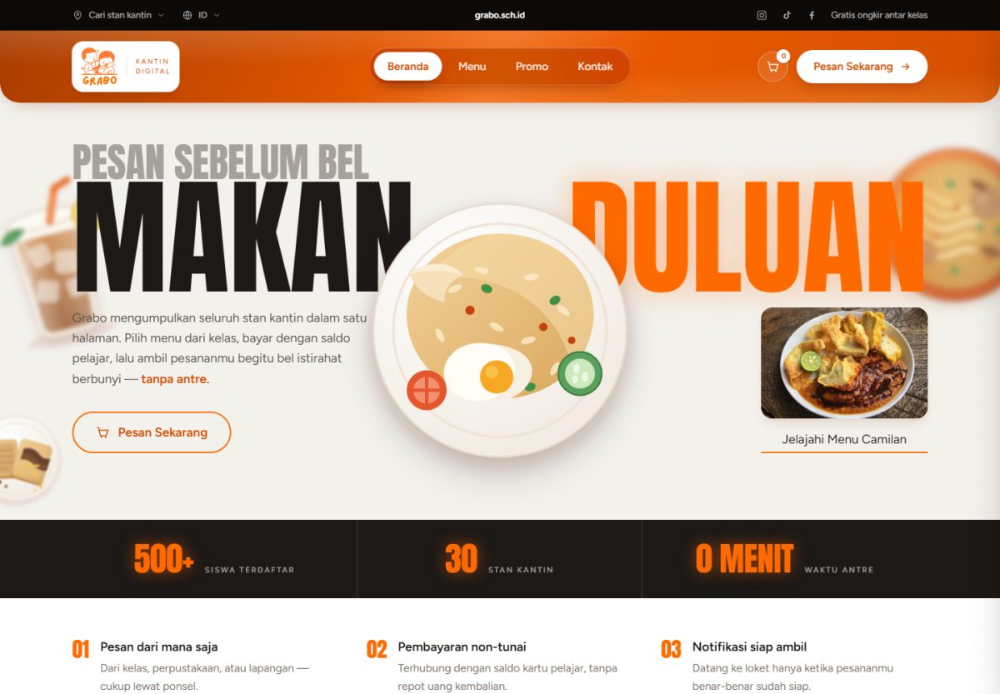
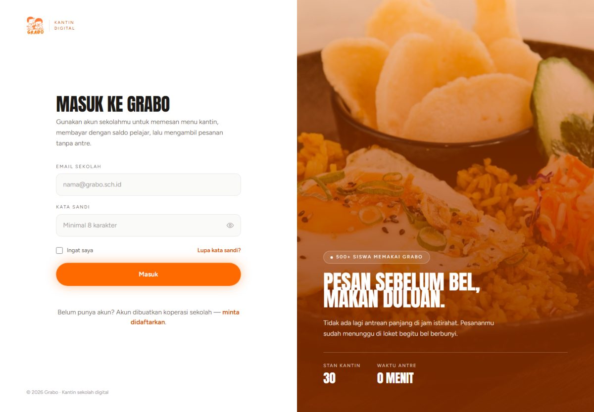
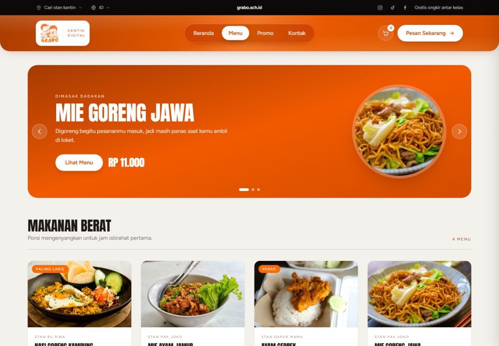
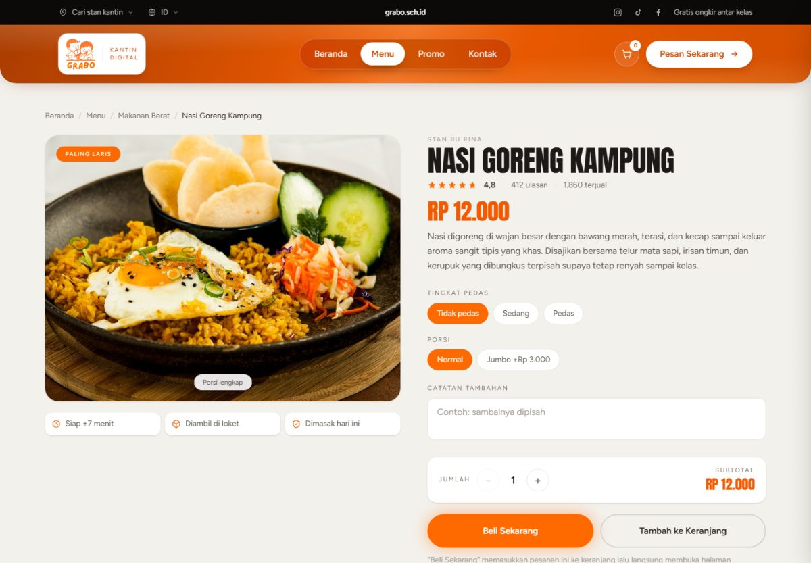
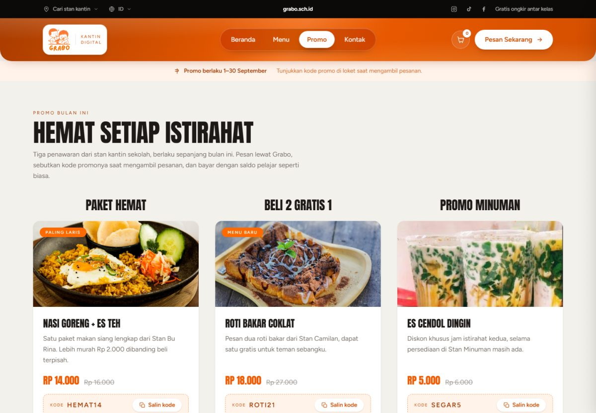
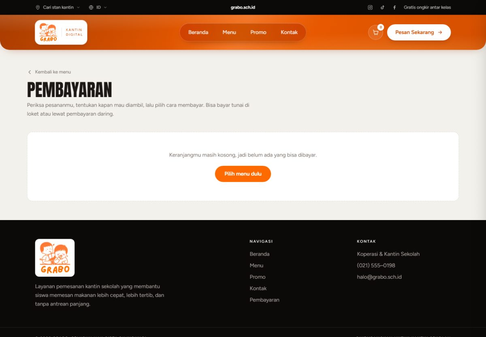
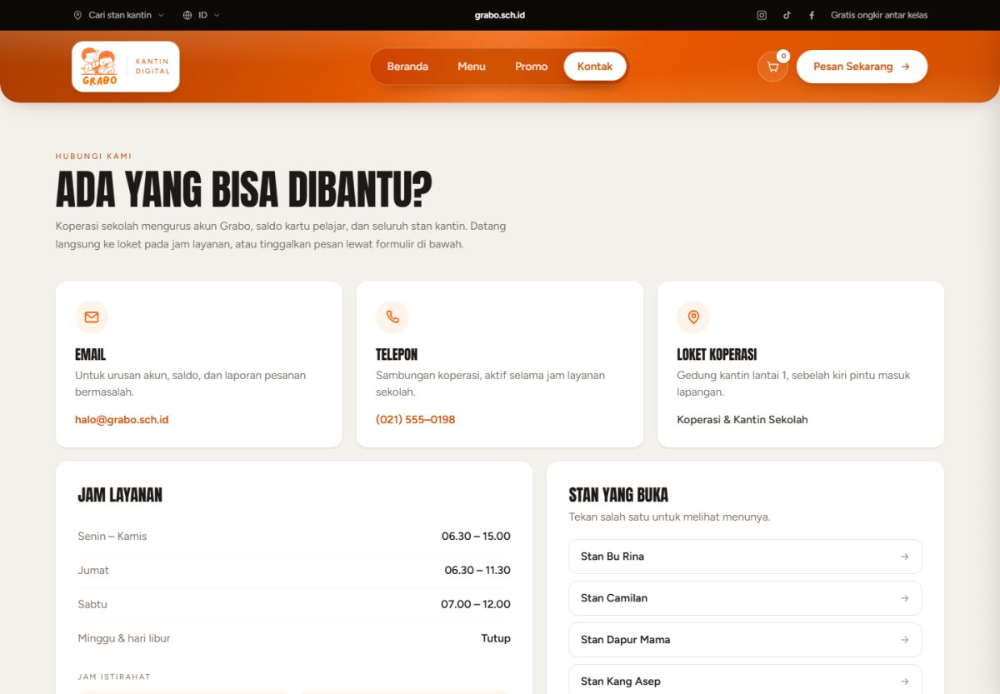

# Grabo — Kantin Sekolah Digital

Situs pemesanan kantin sekolah. Siswa memilih menu dari ponselnya saat masih di
kelas, membayar tunai di loket atau lewat pembayaran daring, lalu mengambil
pesanan tanpa ikut mengantre.



---

## Daftar Isi

- [Latar Belakang](#latar-belakang)
- [Deskripsi Aplikasi](#deskripsi-aplikasi)
- [Fitur Utama](#fitur-utama)
- [Tangkapan Layar](#tangkapan-layar)
- [Teknologi](#teknologi)
- [Cara Menjalankan](#cara-menjalankan)
- [Cara Memakai](#cara-memakai)
- [Struktur Proyek](#struktur-proyek)
- [Sumber Data](#sumber-data)
- [Keputusan Teknis](#keputusan-teknis)
- [Aturan Penamaan](#aturan-penamaan)
- [Pengujian](#pengujian)
- [Batasan Saat Ini](#batasan-saat-ini)
- [Rencana Lanjutan](#rencana-lanjutan)
- [Lisensi](#lisensi)

---

## Latar Belakang

Jam istirahat di sekolah hanya 30 menit, tapi antrean di kantin bisa memakan
sepertiganya. Siswa yang kelasnya jauh dari kantin sering kehabisan menu, dan
petugas stan kewalahan menerima pesanan lisan dari puluhan siswa sekaligus
sambil menghitung uang kembalian.

Grabo memindahkan tahap **memilih dan memesan** ke waktu sebelum bel istirahat
berbunyi. Ketika bel berbunyi, siswa tinggal mengambil pesanan yang sudah
disiapkan.

## Deskripsi Aplikasi

Grabo adalah aplikasi web yang mengumpulkan seluruh stan kantin sekolah dalam
satu halaman. Aplikasi ini ditujukan untuk **siswa** sebagai pemesan, dengan
bagian pengelolaan untuk **petugas kantin** yang sedang dikembangkan.

Alurnya sederhana:

```
Masuk  ->  Pilih menu  ->  Atur varian & jumlah  ->  Keranjang
                                                        |
        Ambil di loket  <-  Kode pesanan  <-  Pilih cara bayar
```

Yang membedakan Grabo dari sekadar daftar menu:

- **Satu halaman untuk semua stan.** Siswa tidak perlu berjalan dari stan ke
  stan untuk tahu apa yang dijual hari ini.
- **Varian dihitung langsung.** Tambah porsi jumbo atau tambah saus langsung
  mengubah harga di layar sebelum masuk keranjang.
- **Harga tidak bisa dipalsukan.** Nilai kiriman dari browser dihitung ulang di
  server memakai harga katalog, jadi total yang muncul selalu sah.
- **Seluruh antarmuka bahasa Indonesia**, termasuk pesan kesalahan formulir dan
  penomoran halaman.

## Fitur Utama

### 1. Masuk & penjagaan halaman

- Halaman masuk terpisah (kiri formulir, kanan gambar) dengan validasi di sisi
  klien: format email diperiksa, kata sandi minimal 8 karakter.
- Tombol mata untuk menampilkan atau menyembunyikan kata sandi.
- Seluruh halaman siswa dijaga middleware `siswa`. Membuka halaman apa pun
  sebelum masuk akan dialihkan ke halaman masuk, dan tujuan awalnya diingat
  supaya bisa dilanjutkan setelah masuk.
- Tombol keluar mengakhiri sesi dan menutup kembali seluruh halaman.

### 2. Beranda

- Hero poster dengan ilustrasi 2D dan ajakan memesan.
- Tiga angka ringkas: siswa terdaftar, jumlah stan, waktu antre.
- Tiga keunggulan layanan.
- Enam menu populer yang bisa langsung dimasukkan ke keranjang lewat tombol
  tambah cepat di kartunya.
- Bagian "Cara Memesan" berisi tiga langkah: Pilih Menu → Kirim Pesanan →
  Ambil Pesanan.

### 3. Daftar menu

- Korsel promo di bagian atas: geser otomatis, bisa dimajukan lewat tombol
  panah atau titik penanda, dan setiap bingkai menuju halaman sajian itu.
- Seluruh sajian dikelompokkan per kategori: Makanan Berat, Gorengan & Camilan,
  dan Minuman.
- **Penyaring per stan** lewat dropdown "Cari stan kantin" di bilah atas.
  Kategori yang jadi kosong tidak ditampilkan, dan ada keterangan berapa sajian
  yang tampil beserta tombol untuk menampilkan semua stan lagi.
- Setiap kartu menampilkan foto, nama stan, harga, dan label seperti
  "Paling Laris" atau "Menu Baru".

### 4. Halaman rincian sajian

- Foto besar, remah roti navigasi, nilai ulasan, jumlah terjual, dan perkiraan
  waktu siap.
- **Pilihan varian** yang berbeda menurut jenis sajian:
  - Makanan: tingkat pedas, porsi (porsi jumbo menambah harga)
  - Camilan: porsi, tambah saus
  - Minuman: suhu, kadar gula, banyak es
- Subtotal berubah langsung setiap varian atau jumlah diubah.
- Kolom catatan untuk stan, misalnya "sambalnya dipisah".
- Dua tombol: **Tambah ke Keranjang** dan **Beli Sekarang** (langsung ke
  halaman pembayaran).
- Tabel spesifikasi: porsi, kemasan, bahan yang dikandung.
- Saran tiga sajian lain dari kategori yang sama.

### 5. Keranjang

- Panel geser dari samping, bisa ditutup lewat tombol, klik latar, atau Escape.
- Lencana angka di ikon keranjang mengikuti jumlah porsi.
- Setiap baris bisa ditambah, dikurangi, atau **diklik untuk diubah** — akan
  membuka kembali halaman rincian sajian itu dengan varian yang sudah terpasang.
- Tombol kosongkan keranjang.
- Isinya disimpan di `localStorage`, jadi tetap ada saat berpindah halaman atau
  menutup tab.

### 6. Kode promo

- Halaman Promo memuat tiga penawaran bulan ini beserta harga sebelum dan
  sesudah diskon.
- Tombol **Salin kode** melakukan dua hal sekaligus: menyalin kode ke papan
  klip dan menyimpannya ke keranjang.
- Indikasi berlapis setelah ditekan: tombol berubah hijau bertanda centang,
  muncul keterangan potongannya, dan kartunya diberi pita **"Sedang dipakai"**
  yang tetap terpasang setelah halaman dimuat ulang.
- Kode juga bisa diketik manual di panel keranjang. Kode yang belum memenuhi
  belanja minimal ditolak dengan keterangan syaratnya.

### 7. Pembayaran

- Ringkasan pesanan, subtotal, potongan promo, dan total bayar.
- Empat langkah bernomor: data pemesan, waktu pengambilan, metode pembayaran,
  catatan.
- Waktu pengambilan: secepatnya, istirahat 1 (09.30), atau istirahat 2 (12.00).
- **Bayar di tempat**: tunai di loket atau saldo kartu pelajar.
- **Bayar daring**: QRIS, transfer bank (dengan pilihan bank), atau dompet
  digital (GoPay, OVO, DANA). Panel rincian tiap metode muncul sesuai pilihan.
- Total dihitung ulang di server dari harga katalog — nilai kiriman browser
  tidak dipercaya.

### 8. Konfirmasi pesanan

- Animasi centang, **kode pesanan** yang ditunjukkan ke petugas, dan tombol
  salin kode dengan tiga lapis cadangan (Clipboard API → `execCommand` →
  menyorot kodenya supaya tinggal ditekan Ctrl+C).
- Ringkasan menu yang dipesan, rincian pemesan, dan cara membayar sesuai metode
  yang dipilih (kode QR contoh, nomor rekening virtual, atau instruksi tunai).
- Tiga langkah selanjutnya beserta status pesanannya.
- Keranjang dan kode promo otomatis dibersihkan setelah ringkasan tergambar.

### 9. Halaman kontak

- Tiga kartu kontak: email, telepon, dan loket koperasi — semuanya tautan aktif
  (`mailto:` dan `tel:`).
- Jam layanan per hari dan jam kedua istirahat.
- Daftar stan yang buka; setiap stan menuju halaman menu yang sudah tersaring.
- Empat pertanyaan yang sering muncul dalam bentuk akordeon.
- Formulir pesan dengan penghitung huruf. Tombolnya menyusun surat di aplikasi
  email siswa, lengkap dengan nama, kelas, topik, dan isi pesan.

### 10. Navigasi & antarmuka

- Bilah navigasi menempel di atas saat halaman digulir, dengan penanda pil
  putih yang **meluncur** ke tab halaman yang sedang dibuka.
- Bilah atas berisi dropdown pilih stan, pilihan bahasa, tautan media sosial,
  identitas pemakai, dan tombol keluar.
- Tampilan menyesuaikan lebar layar: menu ponsel terpisah, kartu menu dua kolom
  di layar kecil dan empat kolom di layar lebar.
- Menghormati `prefers-reduced-motion`: animasi dimatikan bila pemakai memilih
  gerak minimal.
- Seluruh tombol punya label yang terbaca pembaca layar (`aria-label`,
  `aria-expanded`, `aria-current`).

## Tangkapan Layar

| Halaman | Tampilan |
|---|---|
| Masuk |  |
| Daftar menu |  |
| Rincian sajian |  |
| Promo |  |
| Pembayaran |  |
| Kontak |  |

## Teknologi

| Bagian | Dipakai | Alasan |
|---|---|---|
| Bahasa | PHP 8.3+ | Sudah tersedia di Laragon, dipakai di sekolah |
| Kerangka | Laravel 13 | Routing, Blade, validasi, dan middleware siap pakai |
| Templat | Blade | Menyusun halaman langsung dari PHP, tanpa API terpisah |
| Gaya | Tailwind CSS v4 | Token warna dan font diatur di `@theme`, tanpa berkas konfigurasi |
| Pembangun aset | Vite 8 | Membangun CSS cepat dan memuat font mandiri |
| Skrip | JavaScript biasa | Keranjang dan varian tidak butuh kerangka besar |
| Penyimpanan sisi klien | `localStorage` | Keranjang bertahan antar halaman tanpa tabel |
| Basis data | SQLite | Baru menyimpan tabel bawaan Laravel; tabel Grabo dikerjakan menyusul |
| Font | Figtree + Anton | Figtree untuk teks, Anton untuk judul poster |
| Pengujian | Pest | Sintaksnya ringkas dan mudah dibaca |

## Cara Menjalankan

Kebutuhan: PHP 8.3+, Composer, Node.js 20+, dan SQLite (sudah bawaan PHP).

```bash
git clone https://github.com/virgiliolawrence-cell/grabo.git
cd grabo
composer install
npm install
cp .env.example .env
php artisan key:generate
php artisan migrate
npm run build
php artisan serve
```

Buka `http://127.0.0.1:8000`.

Untuk mengembangkan tampilan, jalankan `npm run dev` di jendela terpisah supaya
perubahan CSS langsung terlihat tanpa membangun ulang.

## Cara Memakai

1. **Masuk.** Halaman masuk terbuka lebih dulu. Autentikasi aslinya belum
   dipasang, jadi email berformat benar dan kata sandi minimal 8 karakter sudah
   diterima, misalnya `siswa@grabo.sch.id` / `grabo12345`.
2. **Pilih menu.** Telusuri lewat halaman Menu, atau saring per stan dari
   dropdown di bilah atas.
3. **Atur pesanan.** Buka satu sajian, pilih variannya, tentukan jumlah, dan
   tulis catatan bila perlu.
4. **Pakai promo.** Buka halaman Promo, tekan **Salin kode** pada penawaran yang
   diinginkan.
5. **Bayar.** Buka keranjang, tekan lanjut ke pembayaran, isi data pemesan,
   pilih waktu ambil dan metode bayar.
6. **Ambil pesanan.** Tunjukkan kode pesanan ke petugas stan di loket.

## Struktur Proyek

```
grabo/
├── app/
│   ├── Http/
│   │   ├── Controllers/
│   │   │   ├── Autentikasi/MasukController.php   masuk, proses, keluar
│   │   │   ├── BerandaController.php             beranda
│   │   │   ├── MenuController.php                katalog, daftar, rincian, daftar stan
│   │   │   ├── PembayaranController.php          formulir, simpan, selesai
│   │   │   ├── PromoController.php               kode promo & halaman promo
│   │   │   └── KontakController.php              jam layanan, tanya-jawab
│   │   └── Middleware/
│   │       └── PastikanSiswaSudahMasuk.php       penjaga halaman siswa
│   └── Models/Pengguna.php                       akun bawaan Laravel
├── config/
│   ├── menu.php                                  katalog 12 sajian, 3 kategori
│   └── grabo.php                                 email, telepon, media sosial
├── lang/id/                                      pesan validasi & paginasi
├── resources/
│   ├── css/app.css                               token warna, font, kelas khusus
│   └── views/
│       ├── tataletak/                            grabo, autentikasi
│       ├── bagian/                               navigasi, kaki, keranjang, skrip
│       ├── autentikasi/masuk.blade.php
│       ├── beranda.blade.php
│       ├── menu.blade.php  menu-rincian.blade.php
│       ├── promo.blade.php  kontak.blade.php
│       └── pembayaran.blade.php  pembayaran-selesai.blade.php
├── public/images/food/                           foto sajian & ilustrasi 2D
├── docs/gambar/                                  tangkapan layar untuk README
├── routes/web.php                                 seluruh rute halaman siswa
└── tests/                                         15 pengujian Pest
```

## Sumber Data

Belum ada tabel Grabo; datanya ada di berkas konfigurasi dan browser.

| Sumber | Isi |
|---|---|
| `config/menu.php` | Katalog sajian: nama, stan, harga, jenis varian, deskripsi, foto, galeri, spesifikasi |
| `config/grabo.php` | Email, telepon, dan alamat media sosial kantin |
| `PromoController::kodePromo()` | Kode promo beserta potongan dan belanja minimalnya |
| `localStorage` | Isi keranjang (`grabo.keranjang`) dan kode promo aktif (`grabo.promo`) |
| Session | Status masuk (`grabo_sudah_masuk`) dan rincian pesanan terakhir |

Foto sajian ada di `public/images/food/photos/`, dinamai sesuai slug sajiannya.
Ilustrasi 2D untuk hero beranda ada di `public/images/food/*.svg`.

## Keputusan Teknis

**Total dihitung ulang di server.** Keranjang hidup di browser, jadi isinya bisa
disunting siapa saja lewat peralatan pengembang. Karena itu
`PembayaranController::simpan()` membaca ulang harga setiap baris dari katalog
dan menghitung ulang potongan promo. Nilai `total` kiriman formulir diabaikan.
Sudah diuji: mengirim keranjang berisi sajian karangan dengan `total=1`
menghasilkan total yang benar, dan baris palsunya dibuang.

**Keranjang di `localStorage`, bukan session.** Isinya bertahan meski tab
ditutup, dan tidak membebani server. Setiap pembacaan dibungkus `try/catch`
karena mode penyamaran bisa melarang penyimpanan.

**Satu sumber katalog.** Beranda, halaman menu, halaman rincian, dan perhitungan
pembayaran semuanya memanggil `MenuController::kategori()`. Harga tidak mungkin
berbeda antar halaman.

**Penanda navigasi digeser lewat JavaScript.** Posisinya diukur dengan
`ResizeObserver`, bukan dihitung sekali saat halaman dimuat, supaya tetap tepat
setelah font selesai dimuat dan saat lebar jendela berubah.

**Kelas `.is-terpilih` dipasang JavaScript.** Selektor `:has(input:checked)`
belum ada di peramban lama dan tidak selalu diperbarui saat radio diubah lewat
skrip, jadi kelasnya dipasang manual sebagai pendamping.

**Foto dioptimalkan sebelum dipakai.** Foto kiriman sekolah aslinya sampai
6000×4000 piksel (7,2 MB untuk 12 berkas). Sisi terpanjangnya dibatasi 1400 px
dan disimpan ulang sebagai JPEG, jadi totalnya tinggal 1,3 MB — turun 81% tanpa
perubahan terlihat pada ukuran tampil.

## Aturan Penamaan

Nama berkas, kelas, method, variabel, kelas CSS, atribut `data-*`, dan id elemen
semuanya bahasa Indonesia.

| Bagian | Contoh |
|---|---|
| Controller | `BerandaController`, `MenuController`, `PembayaranController`, `KontakController`, `Autentikasi/MasukController` |
| Method | `tampilkan()`, `daftar()`, `form()`, `simpan()`, `selesai()`, `keluar()` |
| Middleware | `PastikanSiswaSudahMasuk` (alias `siswa`) |
| View | `beranda`, `menu`, `menu-rincian`, `promo`, `kontak`, `pembayaran`, `pembayaran-selesai` |
| Folder view | `tataletak/`, `bagian/`, `autentikasi/` |
| Nama rute | `beranda`, `menu.rincian`, `pembayaran.kirim`, `masuk.proses`, `keluar` |
| Kunci katalog | `nama`, `stan`, `harga`, `jenis`, `sematan`, `galeri`, `spesifikasi` |
| Kelas CSS | `judul-besar`, `kepala-situs`, `kapsul-nav`, `kartu-pilihan`, `titik-promo` |
| id elemen | `panelKeranjang`, `formPembayaran`, `jumlahRincian`, `kodePromo` |
| Fungsi JS | `bacaKeranjang()`, `gambarKeranjang()`, `tampilkanNotifikasi()` |

Yang **tidak** diterjemahkan karena itu nama bawaan, bukan milik proyek ini:

- Direktori kerangka Laravel (`app/Http/Controllers`, `app/Models`, `resources/views`)
- Kelas dan method kerangka (`Controller`, `Request`, `handle()`, `boot()`, `casts()`)
- Kelas utilitas Tailwind (`flex`, `items-center`, `bg-white`)
- API peramban (`localStorage`, `classList`, `addEventListener`, `Intl.NumberFormat`)
- Kunci aturan validasi (`required`, `max`) dan kolom tabel bawaan (`name`, `email`, `password`)

## Pengujian

```bash
php artisan test
```

15 pengujian Pest, terbagi dua:

**`tests/Feature/HalamanSiswaTest.php`** — penjagaan halaman sebelum masuk,
kelima halaman terbuka setelah masuk, seluruh sajian tampil di halaman menu,
penyaring per stan bekerja, dan slug yang tidak dikenal menghasilkan 404.

**`tests/Unit/KatalogTest.php`** — setiap sajian punya berkas foto yang benar
ada, setiap gambar galeri ada berkasnya, katalog tidak lagi memakai ilustrasi
2D, slug tidak ada yang kembar, daftar stan tanpa pengulangan, dan bentuk kode
promo sesuai yang dimengerti keranjang.

## Batasan Saat Ini

- **Autentikasi belum asli.** Email berformat benar dan kata sandi 8 karakter
  sudah diterima; statusnya hanya ditandai di session, belum dicocokkan ke tabel.
- **Pesanan belum disimpan.** Rinciannya dititipkan ke session untuk halaman
  konfirmasi, lalu hilang.
- **Belum ada gerbang pembayaran.** Kode QR dan nomor rekening virtual di
  halaman konfirmasi hanyalah contoh.
- **Belum ada dasbor pengelola.** Menu masih disunting lewat `config/menu.php`.
- **Formulir kontak belum mengirim lewat server**; tombolnya menyusun surat di
  aplikasi email siswa.

## Rencana Lanjutan

1. Tabel `siswa`, `sajian`, `pesanan`, `baris_pesanan`, dan `diskon` beserta
   migrasi dan seeder-nya.
2. Autentikasi asli memakai `Auth::attempt()` dan kata sandi ber-hash.
3. Dasbor pengelola: manajemen menu, daftar siswa, laporan transaksi, dan
   manajemen diskon.
4. Pesanan tersimpan ke database supaya petugas bisa menandai status
   menunggu → disiapkan → selesai.
5. Saldo kartu pelajar ikut terpotong saat memesan.

## Lisensi

Dikembangkan sebagai proyek sekolah. Berjalan di atas Laravel yang berlisensi
[MIT](https://opensource.org/licenses/MIT).
